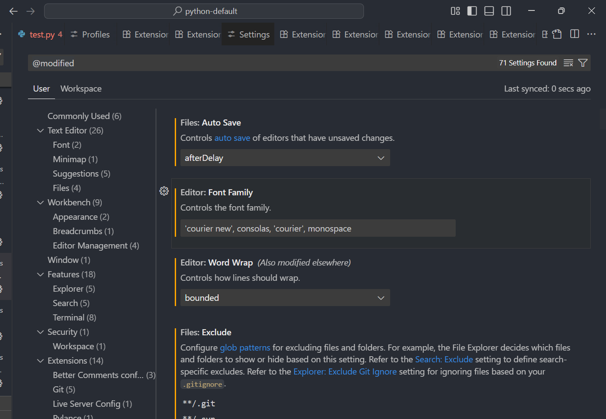
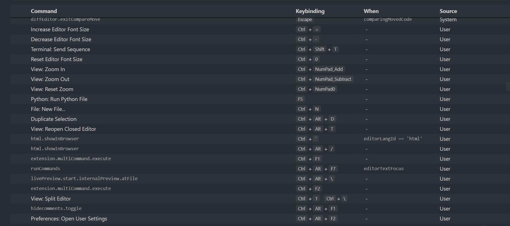
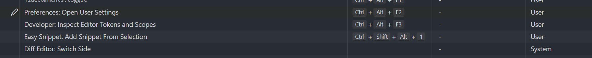
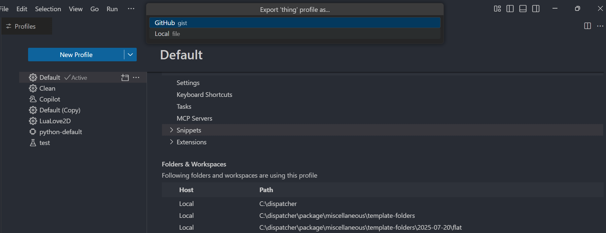
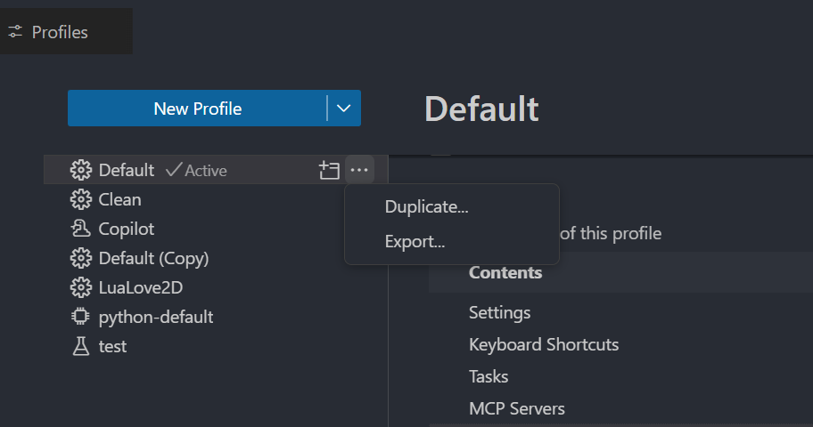
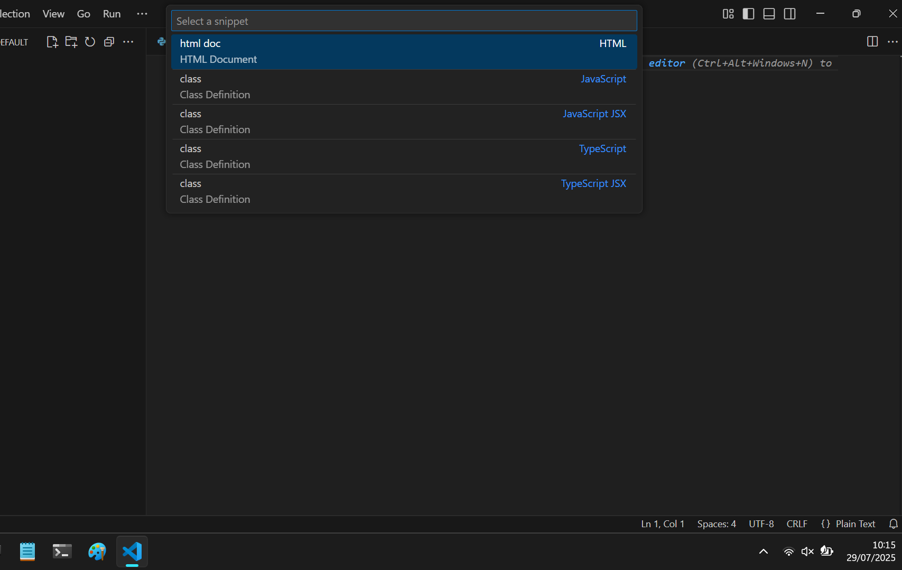
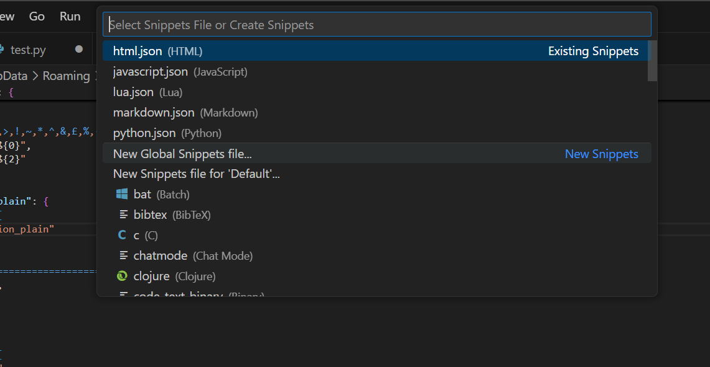
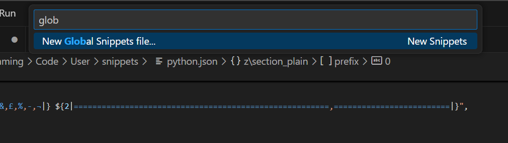
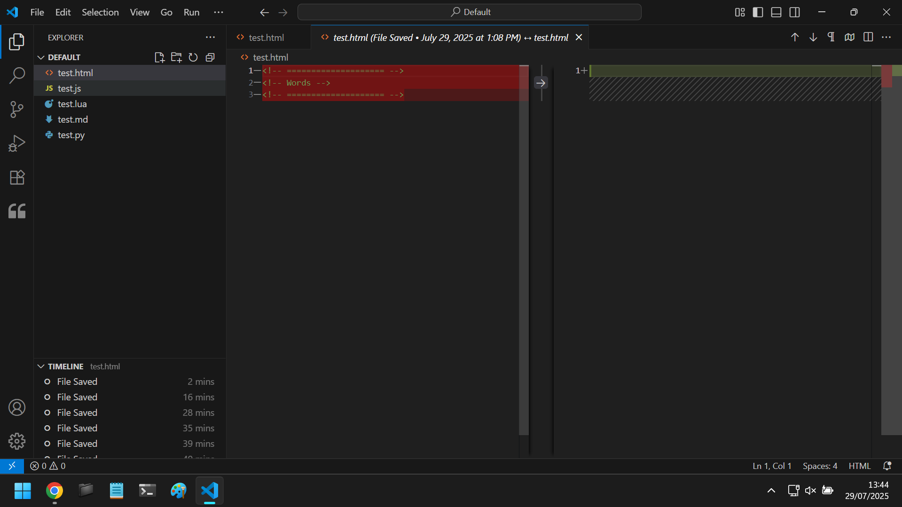
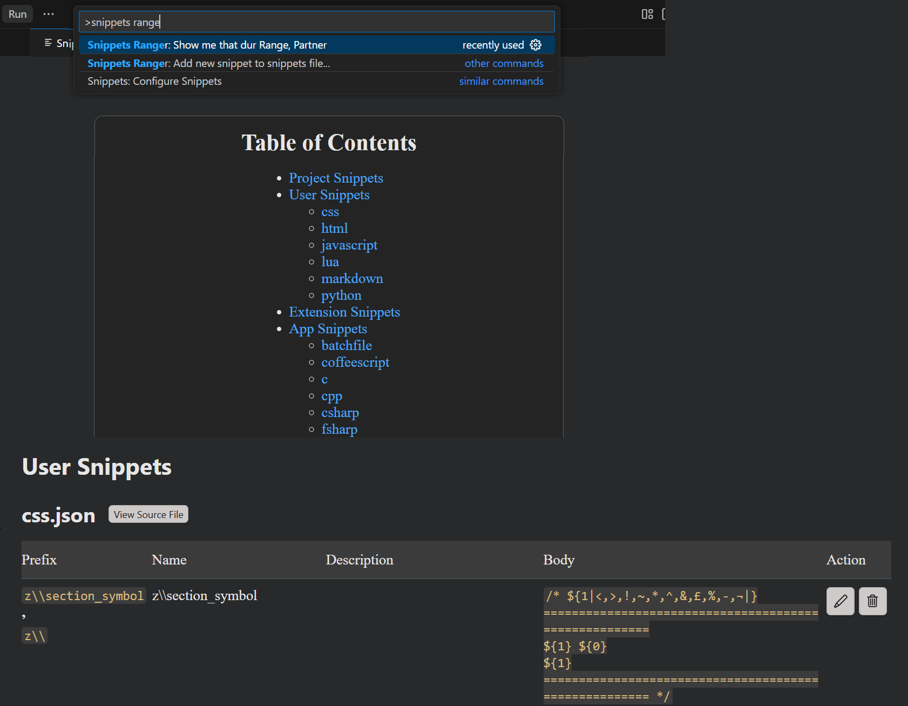

# Miscellaneous
- Autosave is disabled
- `Disable` vs `Disable (Worspace)`
- Learn the `Python Environments` extension
- You cannot inherit snippets from the default profile, so you can't have both current profile snippets and default snippets. You can however define workspace snippets in a `.vscode/snippets/{language}.json` file
  - Currently the best process is
- Copy Setting as JSON "better-comments.multilineComments": true
- Filter modified settings in vscode `@ext:ms-python.vscode-pylance @modified` or just `@modified` they show orange 
- `Ctrl + ,` to open `VSCode` settings
- `Ctrl + P` to open command palette
- Command Palette: `workbench.action.openSettingsJson` not hotkeyed
- Command Palette: `workbench.action.openGlobalKeybindings` not hotkeyed
- Command Palette: `workbench.action.openGlobalKeybindingsFile` not hotkeyed

- Save workspace as
- Open workspace from file
- New window with profile

- `Ctrl + Shift + F`
- `Ctrl + Shift + H`
- `Ctrl + Shift + H`
- Theme: `Dark Modern` / `Default Dark Modern`

- Honestly just reinstall `VSCode` and do not sign in or turn on settings sync
  - Export your profile first

- `Ctrl + Shift + T` added to `VSCode` natively













[text](assets/other/Default.code-profile)

New Global Snippets File
New Snippets File for... -> CREATES `.vscode/{name}.code-snippets`
`.code-snippets`

Copying a profile that has a live link to default will create a static copy, so this is quite useful, you can make features branches of default 

As it stands you need to copy the profile from default (or another) and then you get a fully separate copy, if changes are made to default, you will not see them. If default is good enough this shouldn't be too much of a problem, but there will be cases where snippets and settings change and your different projects will not have access to certain things. It would be great if you could have each profile COMBINE their snippets with default so you can acess both and default can change as needed.

# VSCode Profiles for Each Worksapce
In the simplest terms, a `VSCode` profile contains settings and extensions. Each profile can have a different look, feel, and functionality.

When starting out users typically install many different extensions to their default profile, change the look and feel, change specific settings and set up helpful hotkeys. The issue is that this can all get a bit messy, even for your regular workflow.

The real issue comes when you are switching workflows, for instance working with a `Lua` project instead of a `Python` project, or begin building a web app in `HTML` / `CSS` / `JavaScript`. The extensions you know and love for `Python` might just get in the way of your development

# Understanding a "Workspace"

# Adding a New Profile
You can add new profiles to `VSCode` via `File/Preferences/Profiles/Profile`. And you can select which other profile they copy from, if they are completely separate, or if they perhaps share some things with the default profile

> [!TIP]
> - If you want to create a new profile that has something from another profile then choose that profile in the `Copy From` section. You should even do this if you want to copy from the `Default` profile, because if you do not copy, and instead choose to "follow" the `Default` profile you can run into issues when you want to make changes

# The Default Profile
This profile should open when you open a `VSCode` window in an empty or unknown workspace. It is best to keep as clean as possible such that other profiles can inherit things from it, like default snippets, and some quality of life extensions.

# Changing Profiles Manually

# Binding a Workspace to a Profile
By default, if you create or open a profile in a workspace it should bind that workspace to the profile, meaning that if you open the workspace in future, it should open that profile. If it is not bound you can do this via `File/Preferences/Profiles/Profile` by selecting a profile name and going to `Folders & Workspaces`.

Once a workspace is bound to a profile, if you open that workspace (via a new window) `VSCode` will automatically switch to the associated profile, giving you the correct settings, snippets and extensions etc.

# Themes
Each profile can have a different theme, and you can change switch the theme for the profile whenever you wish, even having different theme based settings for each profile. For instance you might want to use a light theme in the day and a dark theme in night. You can't schedule this, or at least not with ease, but it is easily switched via `File/Preferences/Themes/Color Theme`


## python-default

**Enabled Extensions**
- `Python` -> [ms-python.python](https://marketplace.visualstudio.com/items?itemName=ms-python.python)
  - Description: Python language support with extension access points for IntelliSense (Pylance), Debugging (Python Debugger), linting, formatting, refactoring, unit tests, and more
  - Setting: "python.createEnvironment.trigger": "off"
  - Setting: "python.defaultInterpreterPath": "c:\\Users\\Ben\\AppData\\Local\\Programs\\Python\\Python313\\python.exe"
  - Setting: "python.terminal.activateEnvironment": false
  - Setting: "python.testing.autoTestDiscoverOnSaveEnabled": false
- `Python Debugger` -> [ms-python.debugpy](https://marketplace.visualstudio.com/items?itemName=ms-python.debugpy)
  - Python Debugger extension using debugpy
- `Pylance` -> [ms-python.vscode-pylance](https://marketplace.visualstudio.com/items?itemName=ms-python.vscode-pylance)
  - Description: A performant, feature-rich language server for Python in VS Code
  - Setting: "python.analysis.typeCheckingMode": "basic"
- `Python Environments` -> [ms-python.vscode-python-envs](https://marketplace.visualstudio.com/items?itemName=ms-python.vscode-python-envs)
  - Description: Provides a unified python environment experience
- `Easy Snippet` -> [inu1255.easy-snippet](https://marketplace.visualstudio.com/items?itemName=inu1255.easy-snippet)
  - Turn your selection into a snippet
  - Note: Allows you to add and edit user snippets, that will be converted into `JSON` automatically
  - Adds a "Snippet" section to the side bar
  - Is a little glitchy and adds `\r` all over the place, but is definitely good enough to get the job done
  - Setting: "easySnippet.snippetsPath": "{INSERT_PROFILE_SNIPPETS_PATH_HERE}"

> [!IMPORTANT]
> For `Easy Snippet` you must manually set `easySnippet.snippetsPath` for a custom profile, otherwise it will use the default snippets file

**Disabled Extensions**
- `GitHub Copilot` -> [GitHub.copilot](https://marketplace.visualstudio.com/items?itemName=GitHub.copilot)
  - Description: Your AI pair programmer
- `GitHub Copilot Chat` -> [GitHub.copilot-chat](https://marketplace.visualstudio.com/items?itemName=GitHub.copilot-chat)
  - Description: AI chat features powered by Copilot

**Extension Settings**

**Pylance**
- `python.analysis.typeCheckingMode` -> "basic"

**Other**
- Hidden `Copilot Status` from status bar
- Hidden `Notifications` from status bar
- Hidden `Encoding` from status bar
- Hidden `Editor End of Line` from status bar

**Honourable Mentions**
- `Snippets Ranger` -> [robole.snippets-ranger](https://marketplace.visualstudio.com/items?itemName=robole.snippets-ranger)
  - Description: View and edit all your snippets in one purty place. Yee-haw!
  - Note: Allows you to view, edit, and delete snippets across all profiles, including extension and `VScode` snippets
  - Does not give easy editing, still requires you to manually convert snippets to `JSON`



# Default
- `AHK++ (AutoHotkey Plus Plus)` -> [mark-wiemer.vscode-autohotkey-plus-plus](https://marketplace.visualstudio.com/items?itemName=mark-wiemer.vscode-autohotkey-plus-plus)
  - AutoHotkey v1 and v2 language support for Visual Studio Code: IntelliSense, debugging, formatting, and more!

- `Better Comments` -> [aaron-bond.better-comments](https://marketplace.visualstudio.com/items?itemName=aaron-bond.better-comments)
  - Improve your code commenting by annotating with alert, informational, TODOs, and more!
  - Setting: "better-comments.highlightPlainText": true
  - Setting: "better-comments.multilineComments": true
  - Setting: ""better-comments.tags": [
  {
    "tag": "***",
    "color": "hsl(0, 90%, 40%)"
  },
  {
    "tag": "**",
    "color": "hsl(0, 80%, 60%)"
  },
  {
    "tag": "*",
    "color": "hsl(0, 70%, 80%)"
  },
  {
    "tag": "---",
    "color": "hsl(210, 40%, 45%)"
  },
  {
    "tag": "--",
    "color": "hsl(210, 30%, 55%)"
  },
  {
    "tag": "-",
    "color": "hsl(210, 20%, 65%)"
  },
  {
    "tag": "£££",
    "color": "hsl(160, 90%, 45%)"
  },
  {
    "tag": "££",
    "color": "hsl(160, 80%, 65%)"
  },
  {
    "tag": "£",
    "color": "hsl(160, 70%, 85%)"
  },
  {
    "tag": "$$$",
    "color": "hsl(40, 90%, 50%)"
  },
  {
    "tag": "$$",
    "color": "hsl(40, 85%, 70%)"
  },
  {
    "tag": "$",
    "color": "hsl(40, 80%, 90%)"
  },
  {
    "tag": "%%%",
    "color": "hsl(270, 90%, 45%)"
  },
  {
    "tag": "%%",
    "color": "hsl(270, 80%, 65%)"
  },
  {
    "tag": "%",
    "color": "hsl(270, 70%, 85%)"
  },
  {
    "tag": "^^^",
    "color": "hsl(190, 90%, 45%)"
  },
  {
    "tag": "^^",
    "color": "hsl(190, 80%, 65%)"
  },
  {
    "tag": "^",
    "color": "hsl(190, 70%, 85%)"
  },
  {
    "tag": "&&&",
    "color": "hsl(30, 90%, 45%)"
  },
  {
    "tag": "&&",
    "color": "hsl(30, 80%, 65%)"
  },
  {
    "tag": "&",
    "color": "hsl(30, 70%, 85%)"
  },
  {
    "tag": "!!!",
    "color": "hsl(330, 80%, 88%)"
  },
  {
    "tag": "!!",
    "color": "hsl(330, 90%, 78%)"
  },
  {
    "tag": "!",
    "color": "hsl(309, 100%, 68%)"
  },
  {
    "tag": "<<<",
    "color": "hsl(220, 90%, 45%)"
  },
  {
    "tag": "<<",
    "color": "hsl(220, 80%, 65%)"
  },
  {
    "tag": "<",
    "color": "hsl(220, 70%, 85%)"
  },
  {
    "tag": ">>>",
    "color": "hsl(95, 58%, 56%)"
  },
  {
    "tag": ">>",
    "color": "hsl(95, 48%, 66%)"
  },
  {
    "tag": ">",
    "color": "hsl(95, 38%, 76%)"
  },
  {
    "tag": "???",
    "color": "hsl(45, 90%, 45%)"
  },
  {
    "tag": "??",
    "color": "hsl(45, 80%, 65%)"
  },
  {
    "tag": "?",
    "color": "hsl(45, 70%, 85%)"
  },
  {
    "tag": "|||",
    "color": "hsl(210, 40%, 45%)"
  },
  {
    "tag": "||",
    "color": "hsl(210, 30%, 55%)"
  },
  {
    "tag": "|",
    "color": "hsl(210, 20%, 65%)"
  },
  {
    "tag": "¬¬¬",
    "color": "hsl(180, 90%, 45%)"
  },
  {
    "tag": "¬¬",
    "color": "hsl(180, 80%, 65%)"
  },
  {
    "tag": "¬",
    "color": "hsl(180, 70%, 85%)"
  },
  {
    "tag": "~~~",
    "color": "hsl(270, 90%, 45%)"
  },
  {
    "tag": "~~",
    "color": "hsl(270, 80%, 65%)"
  },
  {
    "tag": "~",
    "color": "hsl(270, 70%, 85%)"
  },
  {
    "tag": "Postit",
    "color": "#000000",
    "backgroundColor": "#bfbf71",
    "bold": true
  }
]"

- `Inline HTML` -> [pushqrdx.inline-html](https://marketplace.visualstudio.com/items?itemName=pushqrdx.inline-html)
  - IntelliSense, Emmet and Syntax Highlighting for html/css inside ES6 Template Strings

- `Live Server` -> [ritwickdey.LiveServer](https://marketplace.visualstudio.com/items?itemName=ritwickdey.LiveServer)
  - Launch a development local Server with live reload feature for static & dynamic pages
  - Setting: "liveServer.settings.donotShowInfoMsg": true

- `Lua` -> [sumneko.lua](https://marketplace.visualstudio.com/items?itemName=sumneko.lua)
  - Lua Language Server coded by Lua

- `WSL` -> [ms-vscode-remote.remote-wsl](https://marketplace.visualstudio.com/items?itemName=ms-vscode-remote.remote-wsl)
  - Open any folder in the Windows Subsystem for Linux (WSL) and take advantage of Visual Studio Code's full feature set

- `Default Themes` -> [vscode.theme-defaults]
  - Description: The default Visual Studio light and dark themes

```jsonc
//  THEMES CAN BE FOUND AND EDITED IN:
// c:\Program Files (x86)\Microsoft VS Code\resources\app\extensions\theme-monokai\themes\
// In that folder I found the Monokai.tm file and modified the first background key as follows:
// <key>background</key>
// <string>#000000</string>
// Testing "Better Comments" extension colour values
// >       Comment text goes here
// >>      Comment text goes here
// >>>     Comment text goes here
// !       Comment text goes here
// !!      Comment text goes here
// !!!     Comment text goes here
// £       Comment text goes here
// ££      Comment text goes here
// £££     Comment text goes here
// $       Comment text goes here
// $$      Comment text goes here
// $$$     Comment text goes here
// %       Comment text goes here
// %%      Comment text goes here
// %%%     Comment text goes here
// ^       Comment text goes here
// ^^      Comment text goes here
// ^^^     Comment text goes here
// &       Comment text goes here
// &&      Comment text goes here
// &&&     Comment text goes here
// *       Comment text goes here
// **      Comment text goes here
// ***     Comment text goes here
// <       Comment text goes here
// <<      Comment text goes here
// <<<     Comment text goes here
// ?       Comment text goes here
// ??      Comment text goes here
// ???     Comment text goes here
// |       Comment text goes here
// ||      Comment text goes here
// |||     Comment text goes here
// ¬       Comment text goes here
// ¬¬      Comment text goes here
// ¬¬¬     Comment text goes here
// ~       Comment text goes here
// ~~      Comment text goes here
// ~~~     Comment text goes here
// -       Comment text goes here
// --      Comment text goes here
// ---     Comment text goes here
// Postit  Comment text goes here
{
    // // Give Powershell administrative privileges
    // "terminal.integrated.profiles.windows": {
    //     "PowerShell": {
    //         "source": "PowerShell",
    //         "args": [
    //             "-ExecutionPolicy",
    //             "Bypass"
    //         ]
    //     }
    // },
    // Change the colours of the VSCode window
    "workbench.colorCustomizations": {
        "activityBar.background": "#282c34",
        "activityBar.border": "#3e3e3e",
        "statusBar.background": "#282c34",
        "titleBar.activeBackground": "#282c34",
        "editor.background": "#282c34",
        "terminal.background": "#282c34",
        "sideBar.border": "#3e3e3e",
        "sideBar.background": "#282c34",
        "sideBarSectionHeader.background": "#3e3e3e",
        "menu.background": "#282c34",
        "badge.background": "#3e3e3e",
        "editorHoverWidget.background": "#282c34",
        "tab.inactiveBackground": "#282c34",
        "tab.inactiveForeground": "#b3b3b3",
        "tab.activeBackground": "#232323",
        "tab.activeForeground": "#b3b3b3",
        "settings.modifiedItemIndicator": "#ffa600",
        "activityBarBadge.background": "#3e3e3e",
        "breadcrumb.background": "#282c34",
        "menu.border": "#3e3e3e",
        "editorGroupHeader.tabsBackground": "#282c34",
        "statusBar.foreground": "#919191",
        "scrollbarSlider.background": "#54545444",
        "focusBorder": "#3e3e3e",
        "editor.lineHighlightBackground": "#282c34"
    },
    // Change word colours part I, semantic colours check for context
    "editor.semanticTokenColorCustomizations": {
        "enabled": true,
        "rules": {
            "class": "#E5C07B",
            "function": "#61AFEF",
            "property": "#E06C75",
            "*.builtin": "#56b6c2",
            "builtinConstant": "#d19a66",
            "module": "#e5c07b",
            "method": "#61AFEF",
            // "operator": "#C678DD",
            "keyword": "#C678DD",
        }
    },
    // Change word colours part II
    "editor.tokenColorCustomizations": {
        "textMateRules": [
            // {
            //     "scope": ["variable.other.object.property.js"],
            //     "settings": {
            //         "foreground": "#E06C75"
            //     }
            // },
            {
                // Used for defualt text and variables
                "scope": [
                    "source.python"
                ],
                "settings": {
                    "foreground": "#ABB2BF"
                }
            },
            {
                // Used for regular expressions / raw strings r'string'
                "scope": [
                    "string.regexp.quoted.single.python"
                ],
                "settings": {
                    "foreground": "#98C379"
                }
            },
            {
                // Used for the import keyword
                "scope": [
                    "keyword.control.import.python"
                ],
                "settings": {
                    "foreground": "#C678DD"
                }
            },
            {
                // Used for keywords such as try, Except, if, while, with, for
                "scope": [
                    "keyword.control.flow.python"
                ],
                "settings": {
                    "foreground": "#C678DD"
                }
            },
            {
                // Used for integer and float numbers
                "scope": [
                    "constant.numeric"
                ],
                "settings": {
                    "foreground": "#d19a66"
                }
            },
            {
                // Used for the elipsis ... in python
                "scope": [
                    "constant.other.ellipsis.python"
                ],
                "settings": {
                    "foreground": "#C678DD"
                }
            },
            {
                // Imaginary numbers such as 3.5j
                "scope": [
                    "storage.type.imaginary.number.python"
                ],
                "settings": {
                    "foreground": "#d19a66"
                }
            },
            {
                // Use of = in declaration and assignment x = 5
                "scope": [
                    "keyword.operator.assignment.python"
                ],
                "settings": {
                    "foreground": "#C678DD"
                }
            },
            {
                // Used for the lambda keyword
                "scope": [
                    "storage.type.function.lambda.python"
                ],
                "settings": {
                    "foreground": "#C678DD"
                }
            },
            {
                // Both single and multi-line strings
                "scope": [
                    "string"
                ],
                "settings": {
                    "foreground": "#98C379"
                }
            },
            {
                // Used for escape characters like backspace n
                "scope": [
                    "constant.character.escape.python"
                ],
                "settings": {
                    "foreground": "#98C379"
                }
            },
            {
                // Used for class keyword
                "scope": [
                    "storage.type.class.python"
                ],
                "settings": {
                    "foreground": "#C678DD"
                }
            },
            {
                // Used for def keyword
                "scope": [
                    "storage.type.function.python"
                ],
                "settings": {
                    "foreground": "#C678DD"
                }
            },
            {
                // Used for -> type annotation
                "scope": [
                    "punctuation.separator.annotation.result.python"
                ],
                "settings": {
                    "foreground": "#C678DD"
                }
            },
            {
                // Used for f-strings and raw strings f'X is {x}'
                "scope": [
                    "storage.type.string.python"
                ],
                "settings": {
                    "foreground": "#98C379"
                }
            },
            {
                // Used for the @ symbol in decorators for instance @property@
                "scope": [
                    "punctuation.definition.decorator"
                ],
                "settings": {
                    "foreground": "#C678DD"
                }
            },
            {
                // Used for the self keyword in class objects
                "scope": [
                    "variable.language.special.self.python"
                ],
                "settings": {
                    "foreground": "#abb2bf"
                }
            },
            {
                // Used for the cls keyword in class objects
                "scope": [
                    "variable.language.special.cls.python"
                ],
                "settings": {
                    "foreground": "#E5C07B"
                }
            },
            {
                // Used for + * / - < > >= == &&
                "scope": [
                    "keyword.operator"
                ],
                "settings": {
                    "foreground": "#C678DD"
                }
            },
            {
                // Used to colour in-line comments
                "scope": [
                    "comment"
                ],
                "settings": {
                    "foreground": "#969696"
                }
            },
            {
                // Used to colour and, or, not, if keywords
                "scope": [
                    "keyword.operator.logical.python"
                ],
                "settings": {
                    "foreground": "#C678DD"
                }
            },
            {
                // Used to colour attributes of classes and functions eg. func.attribute
                "scope": [
                    "meta.attribute.python"
                ],
                "settings": {
                    "foreground": "#E06C75"
                }
            },
            // {
            //     // Used to colour attributes when being indexed
            //     "scope": ["meta.indexed-name.python"],
            //     "settings": {
            //         "foreground": "#E06C75"
            //     }
            // },
            {
                // Used to colour calls to lambda functions and calls to functions as arguments
                "scope": [
                    "meta.function-call.generic.python"
                ],
                "settings": {
                    "foreground": "#61AFEF"
                }
            },
            {
                // Used for magic methods
                "scope": [
                    "support.variable.magic.python"
                ],
                "settings": {
                    "foreground": "#56b6c2"
                }
            },
        ]
    },
    // Set colour codes for different phrases with the Better Comments extension
    "better-comments.tags": [
        {
            "tag": "***",
            "color": "hsl(0, 90%, 40%)"
        },
        {
            "tag": "**",
            "color": "hsl(0, 80%, 60%)"
        },
        {
            "tag": "*",
            "color": "hsl(0, 70%, 80%)"
        },
        {
            "tag": "---",
            "color": "hsl(210, 40%, 45%)"
        },
        {
            "tag": "--",
            "color": "hsl(210, 30%, 55%)"
        },
        {
            "tag": "-",
            "color": "hsl(210, 20%, 65%)"
        },
        {
            "tag": "£££",
            "color": "hsl(160, 90%, 45%)"
        },
        {
            "tag": "££",
            "color": "hsl(160, 80%, 65%)"
        },
        {
            "tag": "£",
            "color": "hsl(160, 70%, 85%)"
        },
        {
            "tag": "$$$",
            "color": "hsl(40, 90%, 50%)"
        },
        {
            "tag": "$$",
            "color": "hsl(40, 85%, 70%)"
        },
        {
            "tag": "$",
            "color": "hsl(40, 80%, 90%)"
        },
        {
            "tag": "%%%",
            "color": "hsl(270, 90%, 45%)"
        },
        {
            "tag": "%%",
            "color": "hsl(270, 80%, 65%)"
        },
        {
            "tag": "%",
            "color": "hsl(270, 70%, 85%)"
        },
        {
            "tag": "^^^",
            "color": "hsl(190, 90%, 45%)"
        },
        {
            "tag": "^^",
            "color": "hsl(190, 80%, 65%)"
        },
        {
            "tag": "^",
            "color": "hsl(190, 70%, 85%)"
        },
        {
            "tag": "&&&",
            "color": "hsl(30, 90%, 45%)"
        },
        {
            "tag": "&&",
            "color": "hsl(30, 80%, 65%)"
        },
        {
            "tag": "&",
            "color": "hsl(30, 70%, 85%)"
        },
        {
            "tag": "!!!",
            "color": "hsl(330, 80%, 88%)"
        },
        {
            "tag": "!!",
            "color": "hsl(330, 90%, 78%)"
        },
        {
            "tag": "!",
            "color": "hsl(309, 100%, 68%)"
        },
        {
            "tag": "<<<",
            "color": "hsl(220, 90%, 45%)"
        },
        {
            "tag": "<<",
            "color": "hsl(220, 80%, 65%)"
        },
        {
            "tag": "<",
            "color": "hsl(220, 70%, 85%)"
        },
        {
            "tag": ">>>",
            "color": "hsl(95, 58%, 56%)"
        },
        {
            "tag": ">>",
            "color": "hsl(95, 48%, 66%)"
        },
        {
            "tag": ">",
            "color": "hsl(95, 38%, 76%)"
        },
        {
            "tag": "???",
            "color": "hsl(45, 90%, 45%)"
        },
        {
            "tag": "??",
            "color": "hsl(45, 80%, 65%)"
        },
        {
            "tag": "?",
            "color": "hsl(45, 70%, 85%)"
        },
        {
            "tag": "|||",
            "color": "hsl(210, 40%, 45%)"
        },
        {
            "tag": "||",
            "color": "hsl(210, 30%, 55%)"
        },
        {
            "tag": "|",
            "color": "hsl(210, 20%, 65%)"
        },
        {
            "tag": "¬¬¬",
            "color": "hsl(180, 90%, 45%)"
        },
        {
            "tag": "¬¬",
            "color": "hsl(180, 80%, 65%)"
        },
        {
            "tag": "¬",
            "color": "hsl(180, 70%, 85%)"
        },
        {
            "tag": "~~~",
            "color": "hsl(270, 90%, 45%)"
        },
        {
            "tag": "~~",
            "color": "hsl(270, 80%, 65%)"
        },
        {
            "tag": "~",
            "color": "hsl(270, 70%, 85%)"
        },
        {
            "tag": "Postit",
            "color": "#000000",
            "backgroundColor": "#bfbf71",
            "bold": true
        },
    ],
    // Force VSCode to automatically format Python code - NOT SURE IF NEEDED
    // "[python]": {
    //     "editor.formatOnType": true
    // },
    // Disable autocompletion for .txt plaintext files
    "[plaintext]": {
        "editor.unicodeHighlight.ambiguousCharacters": false,
        "editor.unicodeHighlight.invisibleCharacters": false,
        "editor.quickSuggestions": {
            "other": "off",
            "comments": "off",
            "strings": "off"
        }
    },
    // Disable autocompletion for .txt plaintext files // ~ Default in case it gets altered
    // "[plaintext]": {
    //     "editor.unicodeHighlight.ambiguousCharacters": false,
    //     "editor.unicodeHighlight.invisibleCharacters": false,
    //     "editor.quickSuggestions": {
    //         "other": "off",
    //         "comments": "off",
    //         "strings": "off"
    //     }
    // },
    // Exclude __pycache__ and .ini files from file explorer window
    "files.exclude": {
        "*.tmp": true,
        "**/__pycache__": true,
        "**/*.ini": true,
        "**/LICENSE": true
    },
    // Associate *.txt files with the "plaintext" language mode
    "files.associations": {
        "*.txt": "plaintext"
    }, // Put snippet suggestions to the bottom of the intellisense suggestion list
    "editor.wordBasedSuggestions": "off", // Disable autocomplete intellisense for just regular english words
    "editor.semanticHighlighting.enabled": true, // POSTIT - NEW
    "editor.suggestSelection": "recentlyUsed", // Set suggestions to favour recent words
    "editor.suggest.showWords": false,
    "editor.wordWrap": "bounded", // Enable or disable word wrapping, where text does not exceed a character limit
    "editor.wordWrapColumn": 140, // Set word wrapping to a specific value, old screens set to 79 characters
    // "editor.rulers": [81], // Adds a visible vertical ruler to the editor to help with code formatting for line length, 81 works best with 79 character limit
    // "python.analysis.autoImportCompletions": false // Disable auto importing when a function from another module is used in the file
    "better-comments.multilineComments": true, // Enable Better Comments extension colours in multi-line strings
    "better-comments.highlightPlainText": true, // Show Better Comments extension colours in plain text files
    "editor.fontFamily": "'courier new', consolas, 'courier', monospace", // Set font family for the editor
    "editor.codeLensFontFamily": "'courier new', consolas, 'courier', monospace", // Set font family for the code lens
    "editor.inlayHints.fontFamily": "'courier new', consolas, 'courier', monospace", // Set the font family for the inlay hints
    "terminal.integrated.fontFamily": "consolas, 'courier new', monospace", // Set the font family for the integrated terminal
    "editor.fontWeight": "normal", // Disable the minimap viewer in the top right by the scrollbar
    "files.defaultLanguage": "python", // Hide the filepath info below the file tabs
    "editor.multiCursorModifier": "ctrlCmd", // Keybind for Ctrl + Click Multicursor
    "editor.autoClosingBrackets": "beforeWhitespace", // Close brackets automatically
    "editor.autoClosingQuotes": "beforeWhitespace", // Close quotes automatically
    "workbench.colorTheme": "Visual Studio Dark", // Set current theme
    "editor.mouseWheelZoom": true, // Alter the font size (rather than the window size) using Ctrl + Mouse Wheel
    "editor.matchBrackets": "never", // Use "never" to Hide the UI system that shows bracket pairs in ugly squares
    "terminal.integrated.cursorBlinking": true, // Enables cursor blinking in the integreated terminal
    "editor.suggest.showStatusBar": true, // Show status bar to enable details on intellisense and snippets
    "terminal.integrated.cursorStyle": "underline", // Sets the cursor for an active integrated terminal to an underline instead of an ugly square
    "terminal.integrated.cursorStyleInactive": "none", // Sets the cursor for an inactive integrated terminal to blank
    "terminal.integrated.defaultProfile.windows": "PowerShell", // Specifies the default terminal profile to use
    "workbench.editor.pinnedTabSizing": "compact", // Sets pinned tabs to be small
    "editor.acceptSuggestionOnEnter": "off",
    "explorer.compactFolders": false, // Set the working directory of the integrated terminal to the directory of the currently opened file
    "explorer.autoReveal": false, // Disable automatic revealing of files and folders in the explorer
    "editor.codeLens": false, // Disable code lense in the editor
    // "diffEditor.codeLens": false, // Disable code lense when comparing two files
    "explorer.incrementalNaming": "smart", // Enable incremental naming behavior for explorer files test1.py test2.py
    "search.sortOrder": "modified", // Specify the search results sorting order as last modified
    "search.mode": "reuseEditor", // Reuse the most recently opened search window instead of creating a new one
    "search.quickOpen.history.filterSortOrder": "recency", // Automatically save files after a delay
    "editor.lightbulb.enabled": "off", // Hide the annoying lightbulb for quick suggestions
    "files.autoSave": "afterDelay",
    "security.workspace.trust.untrustedFiles": "open",
    "editor.minimap.enabled": false,
    "search.searchEditor.defaultNumberOfContextLines": 4,
    "explorer.confirmDragAndDrop": false,
    "workbench.panel.defaultLocation": "left",
    "gist.defaultPrivate": true,
    "git.enableSmartCommit": true,
    "git.confirmSync": false,
    "git.autofetch": true,
    "livePreview.customExternalBrowser": "Chrome",
    "git.openRepositoryInParentFolders": "never",
    "bitoAI.codeCompletion.enableAutoCompletion": true,
    "bitoAI.codeCompletion.enableCommentToCode": true,
    "terminal.integrated.defaultLocation": "editor",
    "terminal.integrated.fontSize": 12,
    "terminal.integrated.rightClickBehavior": "default",
    "python.testing.autoTestDiscoverOnSaveEnabled": false,
    "explorer.confirmDelete": false,
    "search.exclude": {
        "**/_sources": true
    },
    "git.allowForcePush": true,
    "python.terminal.activateEnvironment": false, // Default location for the terminal
    // "terminal.integrated.defaultLocation": "editor", // Setting to allow terminal to open in fullscreen
    "[markdown]": {
        "editor.quickSuggestions": {
            "other": "on",
            "comments": "off",
            "strings": "off"
        }
    },
    "workbench.editor.tabSizingFixedMaxWidth": 80,
    "workbench.editor.tabSizing": "shrink",
    "workbench.editor.enablePreview": false,
    "liveServer.settings.donotShowInfoMsg": true,
    "window.menuBarVisibility": "classic",
    "python.createEnvironment.trigger": "off",
    "breadcrumbs.enabled": false,
    "workbench.editorAssociations": {
        "*.svg": "default"
    },
    "github.copilot.enable": {
        "*": false,
        "plaintext": false,
        "markdown": false,
        "scminput": false
    },
    "remoteHub.commitDirectlyWarning": "off",
    "keyboard.layout": "00000809",
    // "editor.guides.indentation": false,
    "python.analysis.typeCheckingMode": "basic",
    "python.defaultInterpreterPath": "c:\\Users\\Ben\\AppData\\Local\\Programs\\Python\\Python313\\python.exe",
    // Postit - Lines below this point have been edited without my comment [09/09/2023]
}
```

# Possibles

Name: Easy CodeSnap
Id: ArthurLobo.easy-codesnap
Description: Extension to take beautiful custom screenshots of your code 📷
Version: 1.30.4
Publisher: Arthur Lobo
VS Marketplace Link: https://marketplace.visualstudio.com/items?itemName=ArthurLobo.easy-codesnap