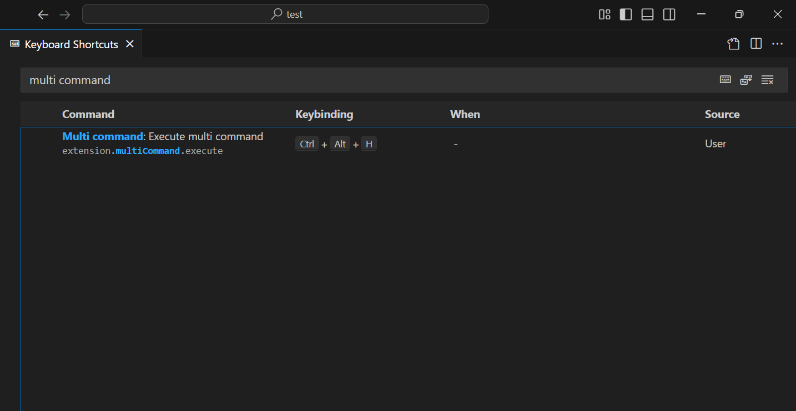
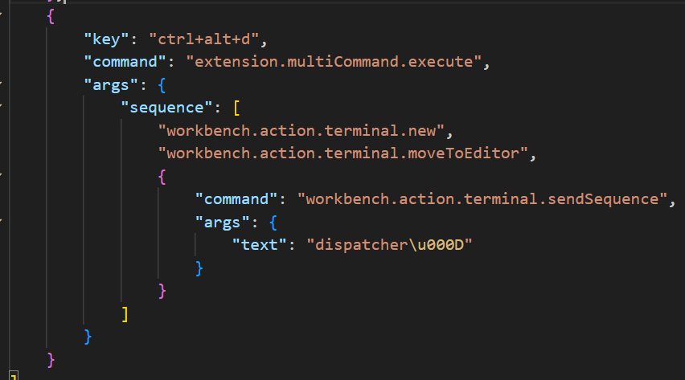
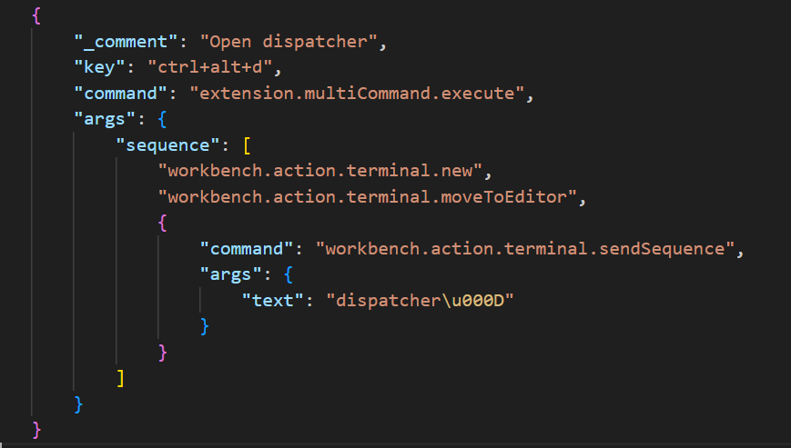
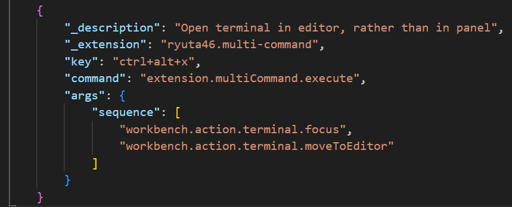
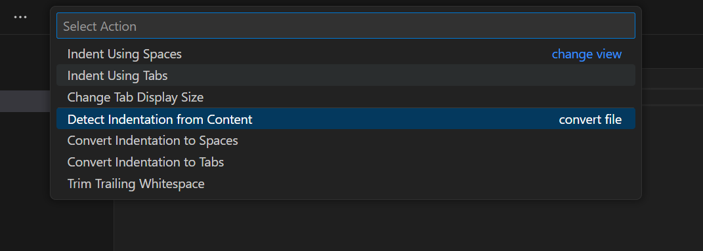
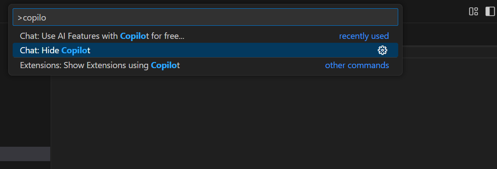
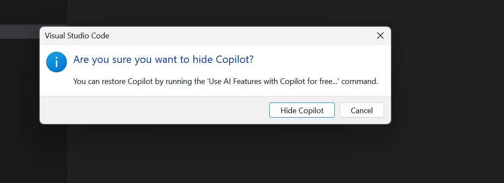

`File/Preferences/Keyboard Shortcuts` then `Open Keyboard Shortcuts (JSON)`








- `Ctrl + Shift + K` delete current line

- Open workspace from file
- Open file in workspace

```json
// "<" was causing issues in HTML due to <!--  -->
{
    "tag": " < ",
    "color": "hsl(220, 70%, 85%)"
},
```

```jsonc
{
    "_description": "Open terminal in editor, rather than in panel",
    "_extension": "ryuta46.multi-command",
    "key": "ctrl+alt+x",
    "when": "!terminalFocus",
    "command": "extension.multiCommand.execute",
    "args": {
        "sequence": [
            "workbench.action.terminal.focus",
            "workbench.action.terminal.moveToEditor"
        ]
    }
},
{
    "_description": "Exit terminal and return to recent file",
    "_extension": "ryuta46.multi-command",
    "key": "ctrl+alt+x",
    "command": "workbench.action.navigateBack",
    "when": "terminalFocus"
}
```

Name: multi-command
Id: ryuta46.multi-command
Description: Invoke multiple commands as one command.
Version: 1.6.0
Publisher: ryuta46
VS Marketplace Link: https://marketplace.visualstudio.com/items?itemName=ryuta46.multi-command