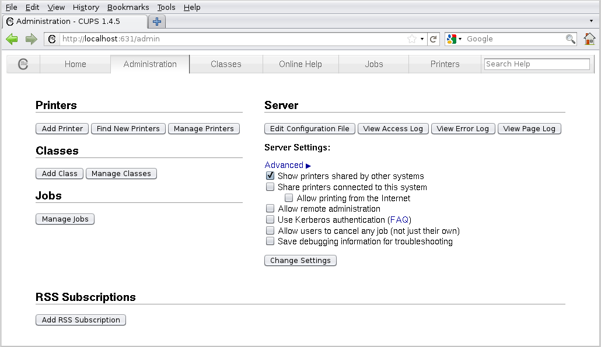

# Overview
The aim is for a service called `CUPS` on the `Pi` to "abstract" the printer

For this project I used a `Raspberry Pi 5` with `2GB` of RAM and `32-bit Raspberry Pi OS Lite`. This means that the system is "headless", meaning it has no desktop or GUI, and runs entirely via command-line interface (CLI)

Some system information can be seen in the code block below
```text
guesshuu@mypi:~ $ hostnamectl
 Static hostname: mypi
       Icon name: computer
      Machine ID: ...
         Boot ID: ...
Operating System: Raspbian GNU/Linux 13 (trixie)
          Kernel: Linux 6.12.47+rpt-rpi-v8
    Architecture: arm64
```

The easiest way to interact with the `Pi` is via `Secure Shell Protocol` (SSH) on a separate machine on the same network. In this case I am using `PowerShell` on `Windows 11` and SSH into the `Pi` via `ssh guesshuu@mypi.local`

The printer is the `Samsung Xpress M2070`, it is not wireless and does not use the modern IPP (Internet Printing Protocol). It is connected to the `Pi` via a USB cable.

To get a list of all the USB devices attached to your `Pi`:
- `lsusb` -> for basic information
- `lsusb -v` -> for more detailed information

```text
guesshuu@mypi:~ $ lsusb
Bus 001 Device 001: ID 1d6b:0002 Linux Foundation 2.0 root hub
Bus 002 Device 001: ID 1d6b:0003 Linux Foundation 3.0 root hub
Bus 003 Device 001: ID 1d6b:0002 Linux Foundation 2.0 root hub
Bus 003 Device 002: ID 04e8:3469 Samsung Electronics Co., Ltd M2070 Series
Bus 004 Device 001: ID 1d6b:0003 Linux Foundation 3.0 root hub
```

I read some documentation and looked through forums for information on setting up a printer. The unanimous suggestion was to install `CUPS` (`Common UNIX Printing System`) which is the open source printing system for `Linux`. 

To install `CUPS`:
- `sudo apt install cups`

To check if `CUPS` is running, use the built-in `systemctl`:
- `systemctl status cups`

Commands added by `CUPS`:
- `lpadmin` -> add, remove or configure printers
- `lpinfo` -> list available printers and drivers
- `lpoptions` -> change printer options

Before you can use the commands for `CUPS` you want to register the current user:
- `sudo usermod -a -G lpadmin guesshuu` -> uses the `usermod` built-in to add user to `lpadmin` group

The before and after registration can be seen in the code block below
```text
guesshuu@mypi:~ $ lpinfo -v
lpinfo: Forbidden
guesshuu@mypi:~ $ sudo usermod -a -G lpadmin guesshuu
guesshuu@mypi:~ $ lpinfo -v
file cups-brf:/
network beh
network ipp
network socket
network https
network lpd
network http
network ipps
direct usb://Samsung/M2070%20Series?serial=ZF44B8KFBD009SN&interface=1
```

To add a printer you want to use the correct driver, but this is often easier said than done as there don't seem to be any `Samsung` drivers when you try `lpinfo -m | grep -i samsung`, and it may not be easy to find one for `ARM` architecture. You can see that `HP` drivers do exist on the system in the code block below

```text
guesshuu@mypi:~ $ lpinfo -m | grep -i samsung
guesshuu@mypi:~ $ lpinfo -m | grep -i hp
lsb/usr/cupsfilters/HP-Color_LaserJet_CM3530_MFP-PDF.ppd HP Color LaserJet CM3530 MFP PDF
lsb/usr/cupsfilters/pxlcolor.ppd HP Color LaserJet Series PCL 6 CUPS
drv:///cupsfilters.drv/dsgnjt600pcl.ppd HP DesignJet 600 pcl, 1.0
...
```

To send a print job to a printer you either need a specific driver, a generic driver, or to send it raw. Listed in order of how effective the method is likely to be. Here it was easier to just use a generic driver `drv:///sample.drv/laserjet.ppd` as seen in the install command:
- `sudo lpadmin -p samsung -E -v "usb://Samsung/M2070%20Series?serial=ZF44B8KFBD009SN&interface=1" -m drv:///sample.drv/laserjet.ppd`

You can check if the printer was installed correctly with `lpstat`
```text
guesshuu@mypi:~ $ lpstat -p
printer samsung is idle.  enabled since Tue 30 Dec 2025 16:42:48 GMT
guesshuu@mypi:~ $ lpstat -l -p samsung
printer samsung is idle.  enabled since Tue 30 Dec 2025 16:42:48 GMT
        Form mounted:
        Content types: any
        Printer types: unknown
        Description: samsung
        Alerts: none
        Location:
        Connection: direct
        Interface: /etc/cups/ppd/samsung.ppd
        On fault: no alert
        After fault: continue
        Users allowed:
                (all)
        Forms allowed:
                (none)
        Banner required
        Charset sets:
                (none)
        Default pitch:
        Default page size:
        Default port settings:
```

Many tutorials suggested some variant of the code block below. Where `everywhere` means driverless or using the `IPP Everywhere` driver, the modern standard. But this requires a wireless, or networked, printer to start with.

```text
sudo lpadmin \
  -p samsung \
  -E \
  -v usb://Samsung/M2070%20Series?serial=ZF44B8KFBD009SN&interface=1 \
  -m everywhere
```

To remove a printer:
- `sudo lpadmin -x samsung`

To print a test page:
- `lp -d samsung /usr/share/cups/data/testprint`
```text
guesshuu@mypi:~ $ lp -d samsung /usr/share/cups/data/testprint
request id is samsung-4 (1 file(s))
```

Other commands:
- `lpstat -W completed -o` -> Shows completed jobs
- `lpstat -W not-completed -o` -> Shows pending or failed jobs

# Wireless Print Server
There is a simple tutorial for making the print server via `CUPS` which can be found [here](https://www.youtube.com/watch?v=hdwqQjDjMzU)

To allow any device on the network to access `CUPS` printers, and submit print jobs:
- `sudo cupsctl --remote-any`

To check if it worked you can use `cupsctl | grep remote`
```bash
guesshuu@mypi:~ $ cupsctl | grep remote
_remote_admin=0
_remote_any=1
```

With `_remote_admin=0`, remote users cannot log in via the web interface or modify printer settings

# CUPS Web Interface
To connect to the print server's web interface ensure the print server is setup, as seen [here](#wireless-print-server). Then find the IP address using `ifconfig`. An abridged version of the output can be seen in the code block below. Where we see an IP address of `192.168.0.57`
```text
guesshuu@mypi:~ $ ifconfig

...

wlan0: flags=4163<UP,BROADCAST,RUNNING,MULTICAST>  mtu 1500
        inet 192.168.0.57  netmask 255.255.255.0  broadcast 192.168.0.255
```

Check that the print server is running and that `CUPS` is listening on port 631
```text
guesshuu@mypi:~ $ ss -ltnp | grep 631
LISTEN 0      4096       127.0.0.1:631       0.0.0.0:*
LISTEN 0      4096           [::1]:631          [::]:*
```

In your browser, navigate to `https://192.168.0.57:631` or `https://192.168.0.57:631/admin`, which will ask you to sign in. Ignore HTTPS certificate warnings from your browser. This is the `CUPS Web Interface`, and is essentially a browser-based GUI for interacting with `CUPS`

An example screenshot of the interface can be seen 

# Connecting from Another Device
Tutorials suggest there are more complicated steps, but once `sudo cupsctl --remote-any` was run it just showed up for all devices as a printer on the network. On `Windows 11` it looks like [this](assets/img/2025-12-31-raspberry-pi-print-server/001.png)

# Miscellaneous
- Once `CUPS` is installed, the print server should load on startup
- Currently it is set up that the computing to make a file "printer-ready" is done by the `Pi`. You can configure it via `sudo nano /etc/cups/cupsd.conf` so that the device sending does the work, eg. `Windows 11` or your phone
  - When the `Pi` is in charge of rasterisation it can be quite slow to print
- It was not needed in this case but many tutorials suggest you need to install `Samba` for a print server